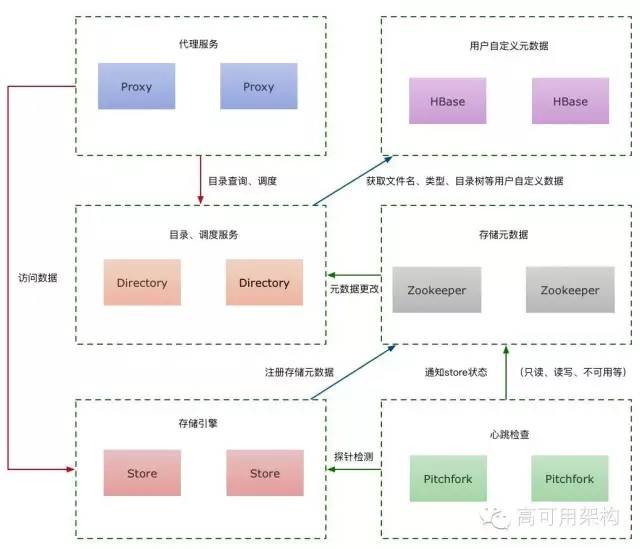

bfs
==============
`bfs` 是基于facebook haystack 用golang实现的小文件存储系统。

---------------------------------------
  * [特性](#特性)
  * [安装](#安装)
  * [集群](#集群)
  * [API](#API)
  * [更多](#更多)

---------------------------------------

## 特性
 * 高吞吐量和低延迟
 * 容错性
 * 高效
 * 维护简单

## 安装

### 一、安装hbase、zookeeper

 * 参考hbase官网. 安装、启动请查看[这里](https://hbase.apache.org/).
 * 参考zookeeper官网. 安装、启动请查看[这里](http://zookeeper.apache.org/).

### 二、搭建golang、python环境

 * 参考golang官网. 安装请查看[这里](https://golang.org/doc/install).
 * 参考python官网. 安装请查看[这里]
(https://www.python.org/)

### 三、安装gosnowflake

 * 参考[这里](https://github.com/fexiao/gosnowflake)

### 四、部署
1.下载bfs及依赖包
```sh
$ go get -u github.com/fexiao/bfs
$ cd /data/apps/go/src/github.com/fexiao/bfs
$ go get ./...
```

2.安装directory、store、pitchfork、proxy模块(配置文件请依据实际机器环境配置)
```sh
$ cd $GOPATH/src/github.com/fexiao/bfs/directory
$ go install
$ cp directory.toml $GOPATH/bin/directory.toml
$ cd ../store/
$ go install
$ cp store.toml $GOPATH/bin/store.toml
$ cd ../pitchfork/
$ go install
$ cp pitchfork.toml $GOPATH/bin/pitchfork.toml
$ cd ../proxy
$ go install
$ cp proxy.toml $GOPATH/bin/proxy.toml

```
到此所有的环境都搭建完成！

### 五、启动
```sh
$ cd /$GOPATH/bin
$ nohup $GOPATH/bin/directory -c $GOPATH/bin/directory.toml &
$ nohup $GOPATH/bin/store -c $GOPATH/bin/store.toml &
$ nohup $GOPATH/bin/pitchfork -c $GOPATH/bin/pitchfork.toml &
$ nohup $GOPATH/bin/proxy -c $GOPATH/bin/proxy.toml &
$ cd $GOPATH/github.com/feixiao/bfs/ops
$ nohup python runserver.py &
```

### 六、测试
 * bfs初始化，分配存储空间，请查看[这里](https://github.com/feixiao/bfs/doc/ops.md)
 * 请求bfs，请查看[这里](https://github.com/feixiao/bfs/doc/proxy.md)

## 集群



bfs 架构包含四个模块，分别是proxy、directory、store、pitchfork。

### proxy 代理模块

 * proxy作为bfs存储的代理以及维护bucket相关,负责屏蔽内部 directory 查找、store 读取和写入等具体的细节逻辑，对外暴露面向资源的 RESTful API。

### directory

 + directory主要负责请求的均匀调度和元数据管理，元数据存放在hbase，由gosnowflake产生文件key

 + 读请求可以根据特定业务的 bucket 以及用户自定义的文件名先从 HBase 查询一次，获取到内部的 store 节点集和具体的文件信息，这样就能提供正常的读服务了。

### store 负责所有图片数据存储

+ 每个用户的图片可能会分布在任何一个 store 节点，store 是核心存储，代码和架构必须要非常谨慎。
+ 为了能和集群通讯，唯一依赖一个外部设施就是 ZooKeeper，但是也非常简单，在初始化阶段本地的 volume（卷轴，后面会详细介绍这个术语，类似盘符）索引（volume 对应的文件路径）和 ZooKeeper 完成一次双向同步。

### pitchfork 心跳检测模块

+ pitchfork负责监控store的服务状态、可用性和磁盘状态
+ Pitchfork 会监控所有 store 节点，定期做 probe 探针检查


### ops

 * ops作为bfs的后台管理界面，负责分配存储、扩容、压缩等维护工作
 
## API
[api文档](https://github.com/feixiao/bfs/blob/master/doc/api.md)


## 参考资料
+ [bfs:支撑Bilibili的小文件存储系统](https://www.jianshu.com/p/923917220d23)